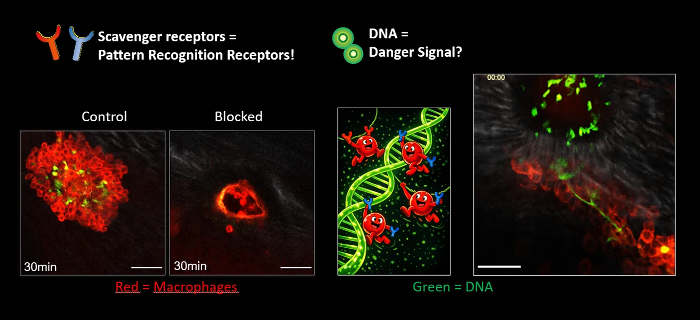
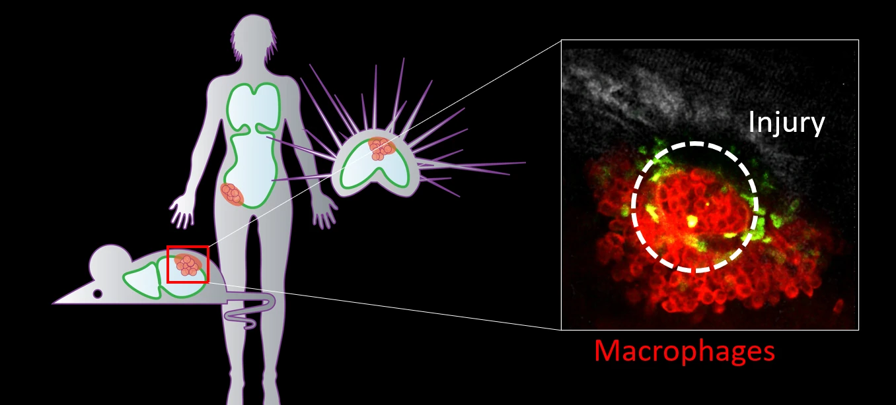

  

Life is full of risks. From microbes to major accidents, injury is a challenge every organism faces, with profound biological consequences. Injury and repair are of ancient origin, conserved from sea urchins to mammals. In an ideal world, the immune system detects damage and triggers a regenerative response that restores both tissue function and architecture *ad integrum*. In most mammals, repair is fast but imperfect — it leaves a scar.

We study what happens at the interface of immunity, tissue repair, and the body cavities. Our work has clinical roots — many of the questions we ask come from problems we encountered in the operating room — but our methods are squarely in mechanistic basic science.

## Themes

### Cavity Macrophage Aggregation

GATA6⁺ macrophages float in the peritoneal fluid and, within minutes of injury, vanish from suspension and pile onto the wound — the so-called macrophage disappearance reaction. We showed this aggregation is driven by scavenger receptors MARCO and MSR1, depends on calcium, and is conserved all the way to sea urchin coelomocytes. We now ask which ligand engages the scavenger receptors, why aggregation is calcium-dependent, why these cells don't aggregate spontaneously, and how their post-injury fate shapes repair versus scarring.

### Mesothelial to Mesenchymal Transition

After surgery, healthy mesothelial cells lose their epithelial identity, turn migratory, and reprogram into myofibroblasts that lay down scar. We've mapped some of this transition and shown it depends on cues from the peritoneal microenvironment, including microbial contamination and EGFR signaling. We are now dissecting the molecular mechanism of mesothelial cell recruitment, the role of immune crosstalk in deciding between physiological repair and pathological scarring, and developing transplantation systems for genetically engineered mesothelial cells.

### Foreign Body Reaction and Implant Lifetime

Surgical injury rarely occurs in isolation — it is usually accompanied by foreign material (sutures, meshes, implants). The combination of tissue damage and biomaterial fundamentally changes how repair proceeds. In collaboration with bioengineers, we study how implant surface properties shape the local immune response, with the aim of designing materials that integrate rather than scar.

### Translational Studies

We connect mouse mechanism to human biology through prospective patient cohorts (in collaboration with surgical partners at Inselspital Bern) and a bio-banked sample pipeline of fresh and frozen human peritoneal cells. A particular interest is the translational gap between mouse and human peritoneal macrophages — including why GATA6 governs mouse cavity macrophages while H2AFY/macroH2A appears to dominate the human counterpart. This bench-to-bedside work also underpins our spin-off, Medhesion, which develops oligonucleotide-based therapies against post-surgical adhesions.

## Methods

### Intravital Microscopy

The signature method of the lab. We image immune cells and mesothelial dynamics in living mice in real time, including through the intact abdominal wall — a model originally developed in the Kubes lab and now extended in Zürich. Our setup is a Leica Stellaris DIVE multiphoton system with a 12 kHz resonant scanner, hybrid detectors, and full FLIM (fluorescence lifetime imaging) capability, allowing us to read out cellular metabolism and signaling states alongside cellular behavior.

### Single-Cell and Spatial Transcriptomics

We use scRNA-seq, regulon inference (pySCENIC), and spatial transcriptomics to map cell states across mouse and human peritoneal tissues, and to identify candidate regulators of mesothelial and macrophage behavior.

### Murine Models of Peritoneal Injury

We use two complementary surgical models we developed and published in detail: the focal peritoneal injury (FPI) model for studying repair, and the peritoneal button (PB) model for adhesion formation. Combined with transgenic, reporter, and lineage-tracing mice — several of which we breed in-house — these allow us to interrogate specific cellular contributions to repair.

### Human Peritoneal Sampling

Through clinical collaborations we have a robust pipeline for fresh human peritoneal fluid and tissue, enabling direct cross-species validation of our murine findings.

## Funding

We are grateful for the support of:

- Swiss National Science Foundation — Starting Grant
- Swiss National Science Foundation — Project Grant
- Swiss National Science Foundation — Weave
- Helmut Horten Foundation
- Geistlich Stucki Foundation
- ETH Foundation
