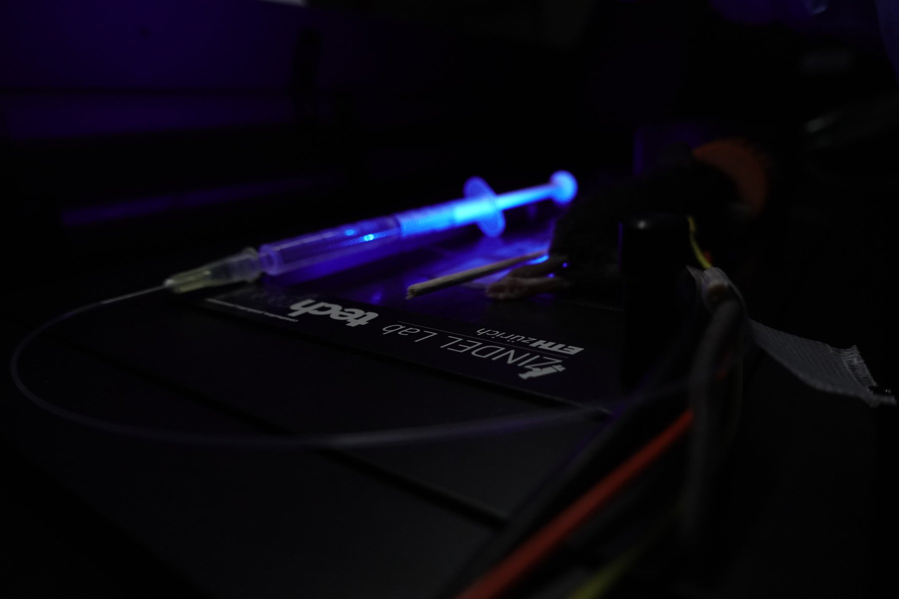

## PhD Students

PhD students in the Zindel Lab are recruited exclusively through the **Life Science Zurich Graduate School (LSZGS)**. Applications outside this framework cannot be considered.

[**Apply via the LSZGS portal →**](https://www.lifescience-graduateschool.uzh.ch/en.html){target="_blank"}

## Postdoctoral Fellows

The lab currently has no funded postdoctoral position open. Fully funded openings, when they arise, are announced on:

[**Joel Zindel on LinkedIn →**](https://www.linkedin.com/in/joel-zindel-a6477429b/){target="_blank"}

## Semester Projects

The lab hosts a limited number of semester projects each year. Applications are reviewed twice annually and selection is competitive.

For inspiration on specific potential projects, please browse [our people](people.qmd) — many lab members advertise topics they would like to supervise on their cards.

**Application materials** — submit to [milkyspots@biol.ethz.ch](mailto:milkyspots@biol.ethz.ch):

- CV
- Academic transcripts
- A half-page motivation letter outlining which topics in the lab's research are of interest

**Decision timeline:**

- Applications for the **autumn semester** — decisions by **May 31**
- Applications for the **spring semester** — decisions by **November 30**

*The email handle "milkyspots" refers to peritoneal milky spots, fat-associated immune aggregates that play a central role in the lab's research.*

## Master Projects & Summer Internships

Master projects and summer internships are typically offered to students who have previously completed a semester project with the lab. Direct inquiries are considered only from applicants in the top 5% of their cohort; submit CV, transcripts, and a half-page motivation letter to [milkyspots@biol.ethz.ch](mailto:milkyspots@biol.ethz.ch).
