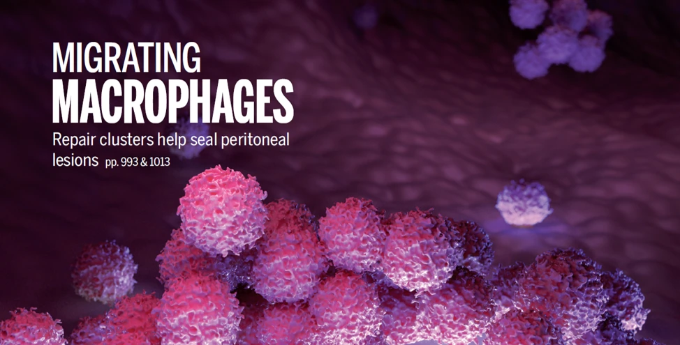

Our publications are maintained on Google Scholar — sorted by date, always up to date.

[View publications on Google Scholar →](https://scholar.google.com/citations?hl=en&user=BkPr9XUAAAAJ&view_op=list_works&sortby=pubdate){.btn .btn-outline-light .btn-lg target="_blank"}

<!--
Why a link instead of an embedded list?
Google Scholar blocks iframe embedding (X-Frame-Options) and aggressively rate-limits
scrapers — any auto-mirror would silently break every few months when Google tweaks
their HTML. A link to the canonical Scholar profile is always current and never breaks.

If you want an in-page list later, ORCID has a stable public API and embeddable widget.
Drop your ORCID iD in here and we can wire that up.
-->
