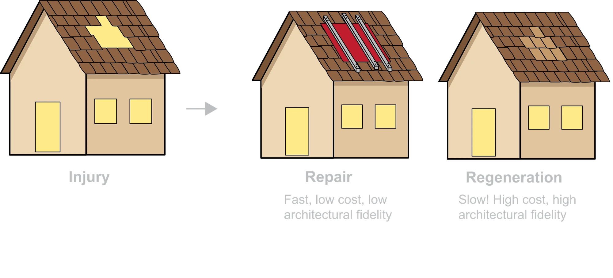

Life is full of risks. From microbes to major accidents, injury is a challenge every organism faces, with profound biological consequences. Injury and repair are of ancient origin, conserved from sea urchins to mammals. In an ideal world, the immune system detects damage and triggers a regenerative response that restores both tissue function and architecture *ad integrum*. In most mammals, repair is fast but imperfect — it leaves a scar.

We study what happens at the interface of immunity, tissue repair, and the body cavities. Our work has clinical roots — many of the questions we ask come from problems we encountered in the operating room — but our methods are squarely in mechanistic basic science.

::: {.lecture-embed}
**▶ After the Scalpel — Beyond Innate Tissue Repair**
*Joel's inaugural lecture at ETH Zürich (April 2026, ~25 min) — an overview of the lab's program, from clinical roots to mechanism.*

<iframe name="Tobira Player"
  src="https://video.ethz.ch/~embed/!v/Ks25B0xXscN?t=03m51s"
  allow="fullscreen"
  style="border: none; width: 100%; aspect-ratio: 1920/1080;"></iframe>
:::

## Themes

### Cavity Macrophage Aggregation

GATA6⁺ macrophages float in the peritoneal fluid and, within minutes of injury, vanish from suspension and pile onto the wound — the so-called macrophage disappearance reaction. We showed this aggregation is driven by scavenger receptors MARCO and MSR1, depends on calcium, and is conserved all the way to sea urchin coelomocytes. We now ask which ligand engages the scavenger receptors, why aggregation is calcium-dependent, why these cells don't aggregate spontaneously, and how their post-injury fate shapes repair versus scarring.

<figure>
<video autoplay muted loop playsinline preload="metadata"
       style="width:100%; height:auto; display:block;">
  <source src="/assets/videos/Aggregation.mp4" type="video/mp4">
</video>
<figcaption>Live aggregation of peritoneal macrophages at a wound — the macrophage disappearance reaction captured by intravital microscopy.</figcaption>
</figure>

### Mesothelial to Mesenchymal Transition

After surgery, healthy mesothelial cells lose their epithelial identity, turn migratory, and reprogram into myofibroblasts that lay down scar. We've mapped some of this transition and shown it depends on cues from the peritoneal microenvironment, including microbial contamination and EGFR signaling. We are now dissecting the molecular mechanism of mesothelial cell recruitment, the role of immune crosstalk in deciding between physiological repair and pathological scarring, and developing transplantation systems for genetically engineered mesothelial cells.

### Foreign Body Reaction and Implant Lifetime

Surgical injury rarely occurs in isolation — it is usually accompanied by foreign material (sutures, meshes, implants). The combination of tissue damage and biomaterial fundamentally changes how repair proceeds. In collaboration with bioengineers, we study how implant surface properties shape the local immune response, with the aim of designing materials that integrate rather than scar.

<figure>
<video autoplay muted loop playsinline preload="metadata"
       style="width:100%; height:auto; display:block;">
  <source src="/assets/videos/Neutrophils.mp4" type="video/mp4">
</video>
<figcaption>Neutrophils swarming to a sterile injury — how does this play out in response to foreign materials?</figcaption>
</figure>

### Translational Studies

We connect mouse mechanism to human biology through prospective patient cohorts (in collaboration with surgical partners at Inselspital Bern) and a bio-banked sample pipeline of fresh and frozen human peritoneal cells. A particular interest is the translational gap between mouse and human peritoneal macrophages. We have been involved in start-ups and also consult for established pharmaceutical companies.

## Methods

### Intravital Microscopy

The signature method of the lab. We image immune cells and mesothelial dynamics in living mice in real time, including through the intact abdominal wall — a model originally developed in the Kubes lab and now extended in Zürich. Our setup is a Leica Stellaris DIVE multiphoton system with a 12 kHz resonant scanner, hybrid detectors, and full FLIM (fluorescence lifetime imaging) capability, allowing us to read out cellular metabolism and signaling states alongside cellular behavior.

### Quantitative Image Analysis

Beautiful imaging is only the starting point. We complement our microscopy with custom in-house pipelines for next-generation cell segmentation, classification, and tracking, run on ETH's high-performance computing infrastructure. These tools turn 4D intravital movies into reproducible, cell-by-cell quantification — bridging visually striking microscopy with the statistically tractable outcomes that mechanistic conclusions require.

<figure>
<video autoplay muted loop playsinline preload="metadata"
       style="width:100%; height:auto; display:block;">
  <source src="/assets/videos/Quantification.mp4" type="video/mp4">
</video>
<figcaption>Automated segmentation and tracking output from our custom analysis pipeline.</figcaption>
</figure>

### Single-Cell and Spatial Transcriptomics

We use scRNA-seq, regulon inference (pySCENIC), and spatial transcriptomics to map cell states across mouse and human peritoneal tissues, and to identify candidate regulators of mesothelial and macrophage behavior.

### Murine Models of Peritoneal Injury

We use two complementary surgical models we developed and published in detail: the focal peritoneal injury (FPI) model for studying repair, and the peritoneal button (PB) model for adhesion formation. Combined with transgenic, reporter, and lineage-tracing mice — several of which we breed in-house — these allow us to interrogate specific cellular contributions to repair.

### Human Peritoneal Sampling

Through clinical collaborations we have a robust pipeline for fresh human peritoneal fluid and tissue, enabling direct cross-species validation of our murine findings.

### Research in Animals

Our research relies in part on animal experimentation, and we approach this responsibility with compassion and rigor. Every experiment we conduct is approved by the cantonal veterinary office after careful review by an ethics commission. This ensures that our work adheres to the 3R principles: wherever we can, we **replace** animal experiments, **reduce** the number of animals used, and **refine** our experimental approach — so that animals are involved only when no alternative can answer the scientific question, in the smallest numbers necessary, and under conditions that minimise distress.

We are convinced that responsible animal research remains essential. Much of what we understand about tissue repair, immunity, and disease — and many of the therapies that have followed — would not exist without it. For this reason, Joel Zindel is a member of [*Verein Forschung für Leben*](https://www.forschung-leben.ch/), a Swiss association of researchers — including colleagues from ETH Zürich — who advocate for the importance of biomedical research and for open, honest dialogue with the public.

## Funding

We are grateful for the support of:

- Swiss National Science Foundation — Starting Grant
- Swiss National Science Foundation — Project Grant
- Swiss National Science Foundation — Weave
- Helmut Horten Foundation
- Geistlich Stucki Foundation
- ETH Foundation
